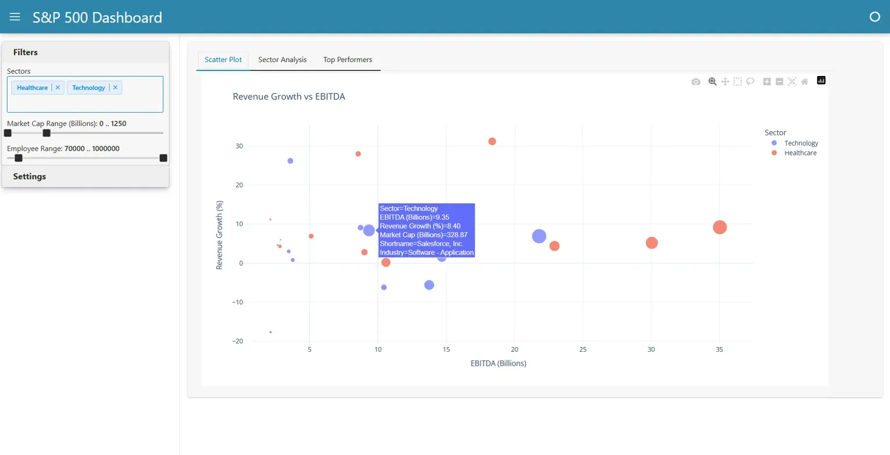
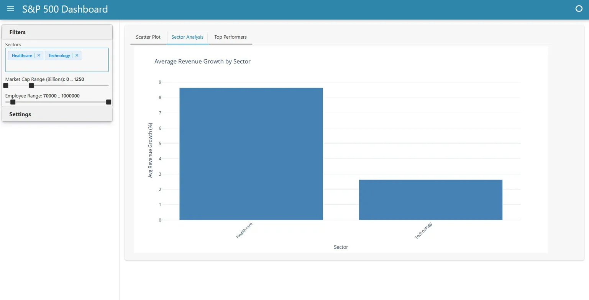
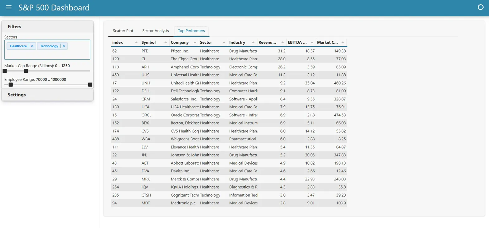

# S&P 500 Performance Dashboard

**Interactive analytics platform for exploring revenue growth and profitability relationships across 502 S&P 500 companies. Enables multi-dimensional filtering and real-time visualization to identify investment opportunities in seconds.**

   

## Business Problem

Investment analysts need to rapidly test hypotheses across financial and geographic dimensions. Static spreadsheets and BI tools force rigid workflows that slow exploratory analysis. Without interactive filtering, answering questions like "Show technology companies in California with >20% revenue growth and market caps above $50B" requires manual Excel work or custom SQL queries.

This dashboard enables dynamic filtering and visualization of 500+ companies, reducing analysis time from minutes to seconds.

## Dataset & Scale

S&P 500 company financials: **502 companies** | **11 sectors** | **16 attributes** | **$45T+ market cap**

Key metrics: Market Cap, EBITDA, Revenue Growth, Employee Count, Geographic Location

## Solution

**Architecture:** CSV → Data API (pandas) → Interactive Dashboard (Panel + Plotly)

**Design Pattern:**
- `sp500_api.py`: Clean separation of data operations (loading, filtering, aggregation)
- `sp500_dashboard.py`: UI layer with callback-based updates
- Star schema logic with computed columns for performance

**Technical Highlights:**
- Multi-dimensional filtering: 5 simultaneous criteria (sector, state, market cap, revenue growth, EBITDA)
- Real-time statistics update with filter changes
- 4 interactive visualization modes

## Dashboard

### Main View: Revenue Growth vs EBITDA Analysis


Scatter plot with customizable coloring by sector/state and sizing by market cap/employees. Includes optional trendline for correlation analysis. Hover tooltips show company details.

### Sector Performance Comparison


Bar chart comparing average revenue growth across sectors. Instantly updates based on applied filters to show sector performance within selected criteria.

### Top Performers Ranking


Sortable table showing top N companies by market cap, revenue growth, or EBITDA. Dynamically adjusts count and metric for flexible analysis.

**Interactive Filtering:**
- Sector selection (11 categories)
- US State geographic filter
- Market Cap range ($0-4T slider)
- Revenue Growth range (-50% to 200%)
- EBITDA range ($0-150B)
- Employee count range

**Real-time Analytics:**
- Company count in filtered set
- Average & median revenue growth
- Average EBITDA
- Total market capitalization

## Key Insights (Example Analysis)

**Healthcare & Technology Sectors (70K-100K employees):**
- 48 companies match criteria
- Average revenue growth: 8.44%
- Healthcare leads with 9.1% average growth
- Notable: Salesforce (8.4% growth, $328B market cap, $9.35B EBITDA)
- Technology shows concentrated high-performers vs broader healthcare distribution

**Investment Screening Use Cases:**
1. **Growth + Scale:** Companies with >15% revenue growth and >$100B market cap
2. **Regional Analysis:** California technology companies for geographic concentration insights
3. **Efficiency Analysis:** High EBITDA margins with moderate growth (cash cow identification)
4. **Outlier Detection:** Companies with unusual growth-profitability relationships

## Tech Stack

**Backend:** Python 3.8+, Pandas (data manipulation), NumPy (numerical operations)

**Frontend:** Holoviz Panel (dashboard framework), Plotly (interactive charts)

**Architecture:** API design pattern with separation of concerns

**Performance:** Vectorized operations, computed columns, callback-based updates

## Installation & Usage

```bash
# Clone and setup (2 minutes)
git clone https://github.com/NikhilGG123/sp500-dashboard.git
cd sp500-dashboard
pip install -r requirements.txt

# Run dashboard
python sp500_dashboard.py
# Opens at localhost:5006
```

**Requirements:** Python 3.8+, pandas, plotly, panel, numpy

## Project Structure

```
sp500-dashboard/
├── sp500_api.py              # Data operations (150 lines)
├── sp500_dashboard.py        # UI layer (250 lines)
├── requirements.txt          # Dependencies
├── data/
│   └── sp500_companies.csv   # Financial dataset
└── images/
    ├── scatterplot.png       # Main dashboard view
    ├── sectoranalysis.png    # Bar chart
    └── topperformers.png     # Ranking table
```

## Technical Implementation

**Data Processing:**
- Removes records with missing critical values (revenue growth, EBITDA, market cap)
- Converts raw values to human-readable units (billions, percentages)
- Pre-computes display columns for instant filtering

**Filtering Engine:**
- Applies 5 simultaneous filters via vectorized pandas operations
- Zero performance degradation with complex filter combinations
- Updates 4 visualizations + statistics in real-time

**API Design:**
- Single responsibility methods (`filter_data`, `calculate_statistics`, `get_sector_summary`)
- Encapsulated data operations separate from UI logic
- Easily testable and extensible for additional metrics

## Use Cases

**Investment Screening:** Identify companies matching specific financial profiles for portfolio construction

**Sector Research:** Compare performance metrics across industries to understand trends

**Geographic Analysis:** Analyze regional concentration patterns and state-level performance

**Outlier Detection:** Spot companies with unusual growth-profitability relationships for deeper research

## Next Steps

- Add time-series analysis for historical trend visualization
- Implement financial ratio calculations (P/E, ROE, debt-to-equity)
- Export functionality for filtered datasets to CSV
- Multi-company comparison mode with side-by-side metrics
- Statistical correlation analysis between revenue growth and other metrics
- Deploy to cloud (Heroku/AWS) for public access

---

**Nikhil Vanama** | [GitHub](https://github.com/NikhilGG123) | vanamanikhil0@gmail.com

*Built to demonstrate proficiency in interactive data visualization, API design, and financial analytics*